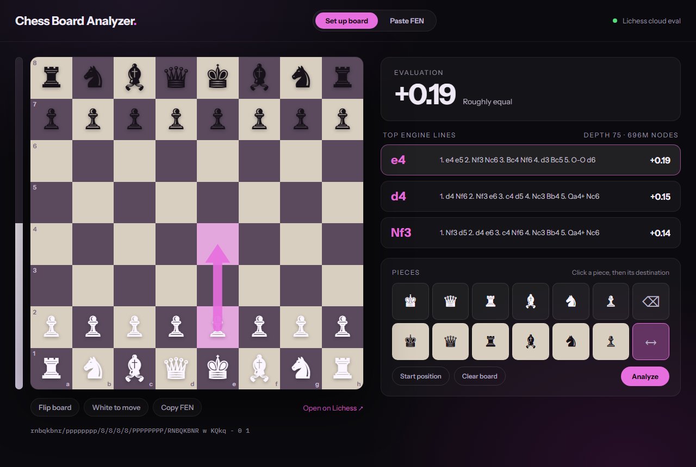

# Chess Board Analyzer

Set up any chess position and instantly see how strong engines evaluate it. Evaluations come from the
[Lichess cloud eval](https://lichess.org/api#tag/Analysis/operation/apiCloudEval) database, so there is no engine to
install and no backend to run — the app is a static page that talks to Lichess straight from the browser.



## Features

- **Set up board** – place, move and erase pieces freely with the piece palette, flip the board, switch the side to move.
- **Paste FEN** – load any position from a FEN string (or one of the sample positions) and play legal moves on the board.
- **Evaluation** – score of the best line from White's point of view, a plain-language verdict and an eval bar.
- **Top engine lines** – up to three principal variations in standard notation with search depth and node count.
  Click a line to highlight its first move with an arrow on the board.
- **Copy FEN** and **Open on Lichess** to continue the analysis with a full engine.
- **Position in the URL** – the current FEN sits in the address bar, so a reload keeps it, the link can be shared,
  and the browser's back button steps through the moves you played.

## Good to know

The cloud database only contains positions somebody has already analysed on Lichess. Openings and common middlegames
are covered at great depth; rare positions are not, and the app says so ("not in the Lichess cloud database").
When a position has no three-line evaluation, the app falls back to a single-line one if it exists.

Requests are debounced while you move pieces, cached per position for the session, and cancelled when superseded.
Lichess rate limits the endpoint per IP — after a "rate limited" message, wait a minute before analysing again.

## Getting started

Requires [Node.js](https://nodejs.org) 22 or newer.

```sh
npm install
npm run dev
```

Then open the URL Vite prints (http://localhost:5173 by default).

| Script            | What it does                                        |
| ----------------- | --------------------------------------------------- |
| `npm run dev`     | Dev server with hot reload                          |
| `npm run build`   | Type-check, then build the static site into `dist/` |
| `npm run preview` | Serve the production build locally                  |

## Deployment

The build output in `dist/` is a plain static site, so any static host works. No environment variables are needed.

On [Vercel](https://vercel.com), import the repository and keep the detected Vite defaults, or deploy from the
command line:

```sh
npm i -g vercel
vercel          # preview deployment
vercel --prod   # production
```

## Tech stack

[Vite](https://vite.dev), [React](https://react.dev) and TypeScript. [chess.js](https://github.com/jhlywa/chess.js)
handles FEN validation, legal moves and notation. The board itself is a small custom component — a CSS grid with
Unicode pieces and an SVG arrow.

```
src/
  App.tsx                 app state and page layout
  index.css               theme and styles
  chess/fen.ts            lenient FEN parsing and serialising for the board editor
  chess/moves.ts          legal moves and engine line → notation, via chess.js
  lichess/cloudEval.ts    cloud eval client: validation, caching, error handling
  hooks/useCloudEval.ts   debounced, cancellable analysis requests
  urlPosition.ts          position ↔ URL hash, for reload, sharing and back/forward
  components/             Board, EngineLines, EditorPanel, FenPanel
```

## Credits

Position evaluations are provided by the [Lichess](https://lichess.org) cloud analysis database, contributed by
Lichess users. This project is not affiliated with Lichess.
